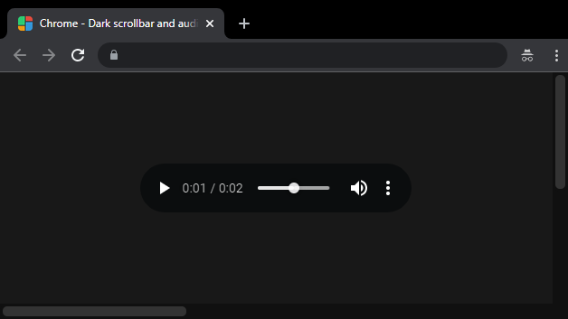
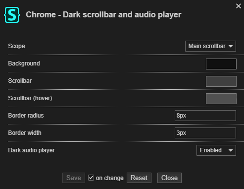

# Chrome - Dark scrollbar and audio player

## Description

Styles the scrollbar and audio player components to a dark theme (WebKit only).

## Preview

## Settings overview

## Installation

- [UserCSS](./chrome-dark-scrollbar-and-audio-player.user.css) (view raw file to install. Requires the [Stylus](https://github.com/openstyles/stylus#releases) browser extension).