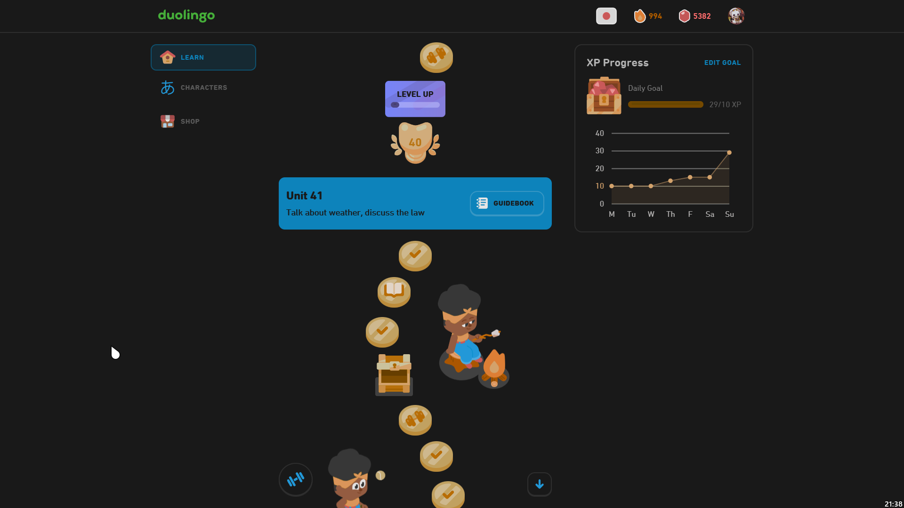

# Duolingo - Dark theme

## Description

Dark theme for Duolingo.

## Preview

## Installation

- [UserCSS](./duolingo-dark.user.css) (requires the [Stylus](https://github.com/openstyles/stylus#releases) browser extension; press the "Raw" button to install).