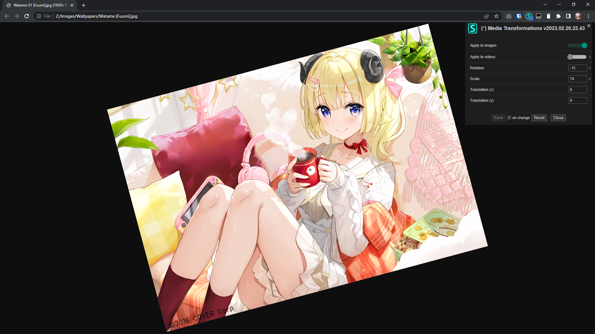
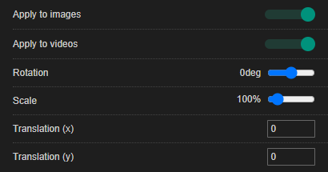

# Media Transformations

## Description

Applies configurable transformations to images and/or videos.

## Preview

## Settings overview

## Installation

- [UserCSS](./media-transformations.user.css) (requires the [Stylus](https://github.com/openstyles/stylus#releases) browser extension; press the "Raw" button to install).
