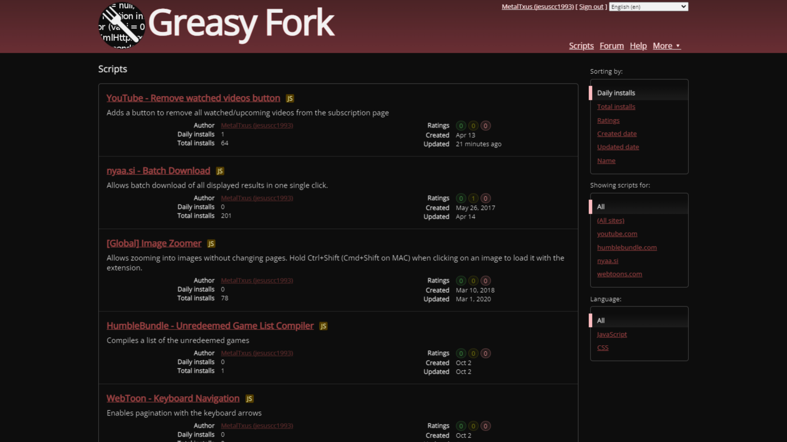

# GreasyFork - Dark theme

## Description

Quick dark theme for GreasyFork. Doesn't look great, but doesn't burn my eyes.

## Preview

## Installation

- [UserCSS](./greasyfork-dark.user.css) (requires the [Stylus](https://github.com/openstyles/stylus#releases) browser extension; press the "Raw" button to install).