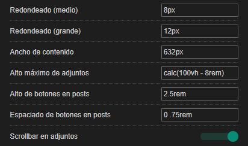

# Nakama - Personalización

## Description

Permite la configuración de ciertos aspectos visuales en Nakama.

## Preview

## Settings overview

## Installation

- [UserCSS](./nakama.social-personalizacion.user.css) (requires the [Stylus](https://github.com/openstyles/stylus#releases) browser extension; press the "Raw" button to install).
