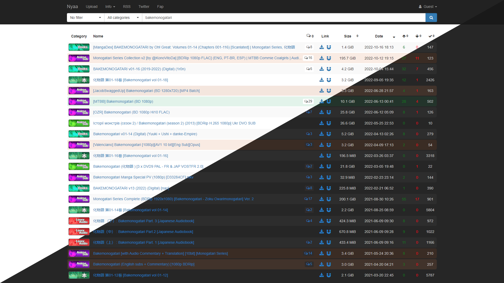

# nyaa.si - Customization

## Description

Provides some extra customization options for nyaa.si.

## Preview

## Settings overview

## Installation

- [UserCSS](./nyaa.si-customization.user.css) (requires the [Stylus](https://github.com/openstyles/stylus#releases) browser extension; press the "Raw" button to install).
