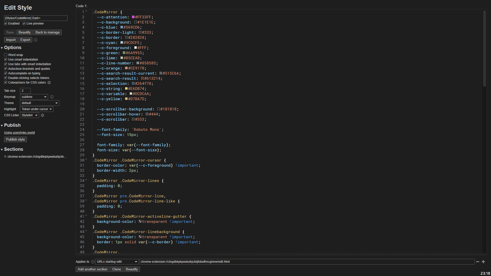

# Stylus - Dark+ (CodeMirror theme)

To install, view the raw files. Requires the [Stylus](https://github.com/openstyles/stylus#releases) browser extension.

## Preview

## Installation

- [UserCSS](./stylus-codemirror-dark-plus.user.css) (requires the [Stylus](https://github.com/openstyles/stylus#releases) browser extension).