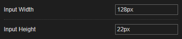

# Stylus - Dark theme

## Description

Dark theme for the Stylus extension (Chrome only).

## Settings overview

## Installation

- [UserCSS](./stylus-editor-customization.user.css) (view raw file to install. Requires the [Stylus](https://github.com/openstyles/stylus#releases) browser extension).
