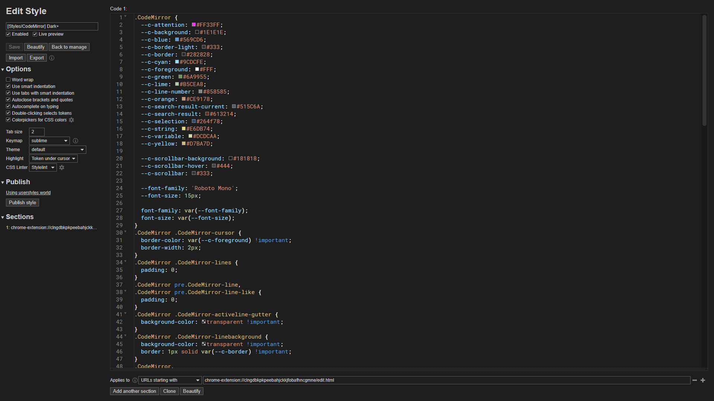

# Stylus - Dark+ (CodeMirror theme)

## Description

Dark+ CodeMirror theme for the Stylus extension (Chrome only).

## Preview

## Installation

- [UserCSS](./stylus-codemirror-dark-plus.user.css) (view raw file to install. Requires the [Stylus](https://github.com/openstyles/stylus#releases) browser extension).