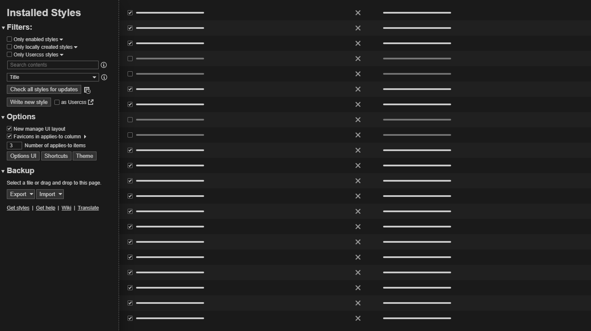

# Stylus - Dark theme

## Description

Dark theme for the Stylus extension (Chrome only).

## Preview

## Installation

- [UserCSS](./stylus-dark.user.css) (requires the [Stylus](https://github.com/openstyles/stylus#releases) browser extension).